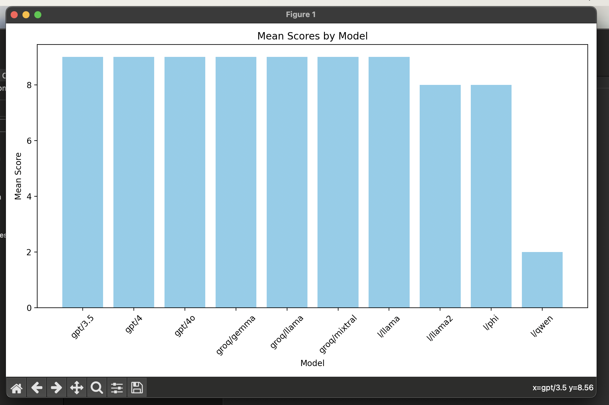

# Evaluate

This is an example of doing simple model evaluation of RAG based prompt pipeline. Quality of the model response is evaulated using another LLM model. The Judge model compares the input prompt against the output responses to determine the quality of the response. The score is then used to rank the models.

## Requirements

- [cllm](https://github.com/o3-cloud/cllm) installed
- OpenAI API key and OPENAI_API_KEY set in the environment
- Ollama installed and models downloaded with chat completion API running
- Groq Cloud and GROQ_API_KEY set in the environment

## Examples

Evaluate a single model ./.cllm/systems directory against the prompting guide vector store.

```bash
RAG=promptingguide
PROMPT="What is a RAG?"
task evaluate rag=${RAG} rag_fetch=5 prompt="${PROMPT}" model=l/llama
```

Evaluate all the models in the ./.cllm/systems directory against the prompting guide vector store.

```bash
RAG=promptingguide
PROMPT="What is a RAG?"
task all rag=${RAG} rag_fetch=5 prompt="${PROMPT}"

task report rag=${RAG}

```

Evaluate just the defined ollama the models using the cllm vector store.


```bash
RAG=cllm
PROMPT="What is cllm and how does it work?"
task exp-local-models rag=${RAG} rag_fetch=5 prompt="${PROMPT}"

task report rag=${RAG}
```

## Output

The output of the evaluation is a table of the models and their scores. The scores are based on the quality of the response to the prompt. The higher the score the better the response.



Example output of the evaluation of the models against the cllm vector store. See [traces/cllm](traces/cllm) directory.